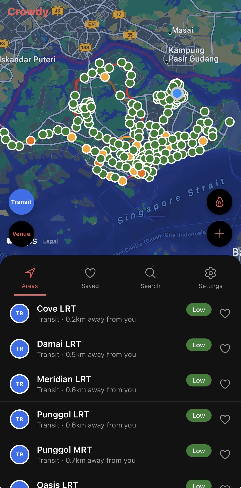
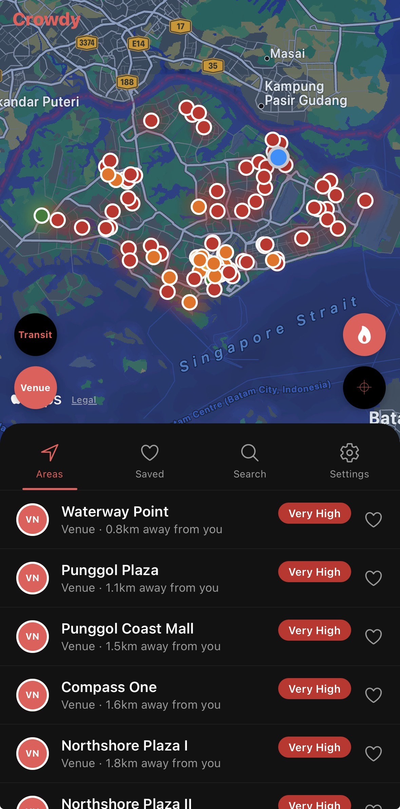
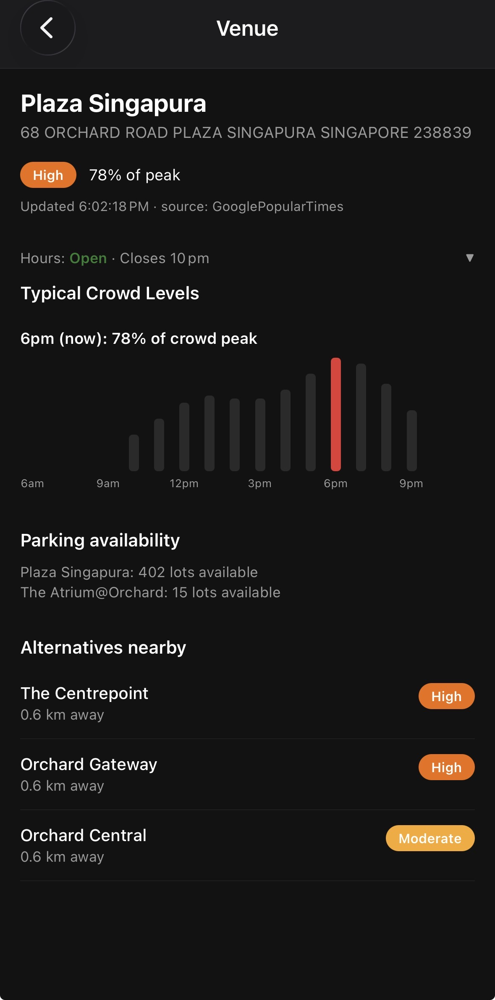
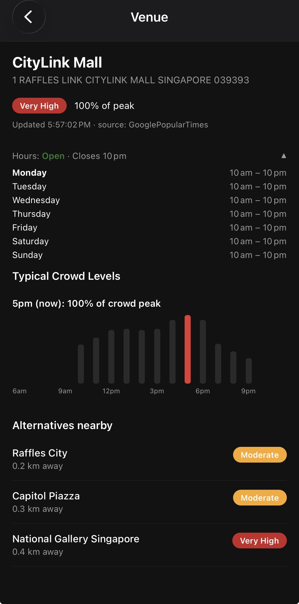
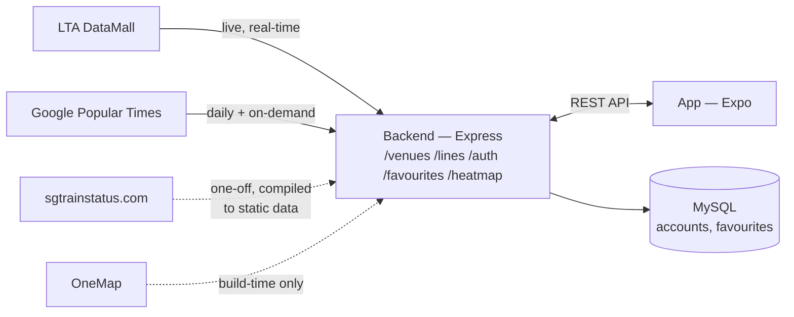

# Crowdy

Part of NTU SC2006 Software Engineering.


<p align="center">
  
  
  
  
</p>


## Overview

Crowdy is a Singapore-only app for checking real-time crowd levels at MRT/LRT stations and shopping malls/attractions before heading there, with lower-crowd alternatives of the same type surfaced nearby when one exists. It's built as two independent pieces — an Expo/React Native app and a Node/Express backend.



*(Dashed arrows = one-off/build-time only, not fetched while the app is running.)*

## Tech Stack

### Backend
- **Runtime**: Node.js, TypeScript, run via `ts-node-dev` in development
- **Framework**: Express
- **Database**: MySQL (hosted on [Aiven](https://aiven.io)'s free tier), via `mysql2`
- **Authentication**: JWT (`jsonwebtoken`) + password hashing (`bcryptjs`)
- **Scraping**: Puppeteer (`puppeteer-extra` + stealth plugin) — drives a real headless browser for Google Popular Times, since no official API exists for it
- **Other**: `cors`, native `process.loadEnvFile()` for `.env` loading (no `dotenv` dependency needed)

### Frontend
- **Framework**: Expo / React Native, TypeScript — one codebase targeting iOS, Android, and web
- **Navigation**: React Navigation (native stack)
- **Maps**: `react-native-maps` (Apple Maps on iOS by default) + `react-native-map-clustering`
- **State**: React Context (`AuthContext`, `ThemeContext`) — no external state library
- **Storage**: `expo-secure-store` (session token), `@react-native-async-storage/async-storage` (on-device saved venues for guests)
- **Icons**: `@expo/vector-icons`

## Architecture & Design Patterns

### Backend Architecture
1. **Resource-oriented routing** — one router per resource (`/venues`, `/lines`, `/auth`, `/favourites`, `/heatmap`), each owning only its own resource's endpoints.
2. **Middleware for cross-cutting concerns** — `requireAuth` verifies the bearer token once and attaches the account id (via `res.locals`, not a global type augmentation) before any protected route body runs; `cors()` and `express.json()` are applied globally.
3. **Stateless authentication** — JWT bearer tokens (30-day expiry), not server-side sessions. Every request carries everything needed to authenticate it, so the backend holds no per-user connection state.
4. **Service-layer separation** — each external concern (LTA, carpark lots, Google Popular Times, the heatmap image, alternatives, distance math, auth, the DB pool) lives in its own file under `services/`. Simple resource CRUD (accounts, favourites) queries the database directly from its route; anything that talks to an external source or does real computation goes through a dedicated service instead.
5. **Cache-with-TTL, repeated deliberately** — Popular Times, LTA carpark lots, and the rendered heatmap image are each cached with their own freshness window, matched to how often that specific source actually changes (5 minutes for LTA, ~daily for Popular Times) rather than one blanket policy.
6. **Consistent error shape** — failures return `{ error: "..." }` with a standard HTTP status (400/401/404/409/500); the same generic message is used for both "wrong password" and "no such account" on login, so a failed attempt can't be used to enumerate registered usernames.
7. **Graceful shutdown** — `SIGINT`/`SIGTERM` close the HTTP server, the shared Puppeteer browser, and the DB pool, each bounded by its own timeout so one stuck step can't block the others or the process exit itself.

### Frontend Architecture
1. **Platform-specific implementation resolution** — `VenueMap.native.tsx` / `VenueMap.web.tsx`; Metro picks the right one per platform automatically, so nothing consuming `VenueMap` ever branches on platform itself.
2. **Context/Provider pattern** — `AuthContext` and `ThemeContext` hold cross-cutting state (session, light/dark mode) without prop-drilling it through every screen.
3. **One service owns the backend, exclusively** — `services/api.ts` is the only file that constructs a request to the backend; every screen calls a named function from it instead of building its own URL/fetch call.
4. **Local-first, server-synced once signed in** — saved venues work fully offline as a guest (AsyncStorage) and transparently switch to the account's real favourites (MySQL, via the backend) once signed in, with an explicit prompt (not a silent merge) to bring guest saves into the account.
5. **Optimistic UI updates** — toggling a favourite updates local state immediately and syncs to whichever store is current (device or account) after, rather than waiting on the network round-trip to reflect the change.

## SOLID Principles Implementation

### Single Responsibility
Each backend service file owns exactly one external concern — `lta.ts` only talks to LTA's API, `popularTimes.ts` only handles the Popular Times scrape, `heatmapImage.ts` only renders the overlay image. On the client, `api.ts` owns backend communication and `savedVenues.ts` owns on-device persistence — neither touches the other's job.

### Open/Closed
Adding the heatmap didn't require modifying any existing scraper or route — it's a new, independent service that reads already-computed `Venue` data and exposes its own endpoint. The same is true of the two most recently added sources (Popular Times, then the heatmap image): each was added alongside what existed, not by editing it.

### Liskov Substitution
Every venue-like entity — a mall (Google Popular Times) or a transit station (LTA) — conforms to the same `Venue` interface regardless of its underlying data source, so any code that consumes a `Venue` (the map, the list, the Detail screen) works uniformly without knowing or caring which source it came from.

### Interface Segregation
`api.ts` exposes narrow, purpose-specific functions per need (`getFavourites`, `saveFavourite`, `getHeatmapBounds`, ...) rather than one generic request function every screen has to configure itself.

### Dependency Inversion
Routes depend on service-layer functions (`getVenues()`, `refreshPopularTimesNow()`) rather than on Puppeteer or LTA specifics directly — how a venue's crowd data is actually sourced can change without touching the route that serves it, or the app that consumes it.

## Setup Instructions

### Backend Setup
1. `cd server && npm install`
2. Create `server/.env` with:
   ```
   LTA_ACCOUNT_KEY=<your LTA DataMall account key>
   DB_HOST=<mysql host>
   DB_PORT=<mysql port>
   DB_NAME=<database name>
   DB_USER=<db user>
   DB_PASSWORD=<db password>
   DB_SSL_CA_PATH=./certs/aiven-ca.pem   # required for the hosted (Aiven) database; omit for a local MySQL install
   JWT_SECRET=<any random string>
   ```
3. `npm run dev` — starts the backend at `http://localhost:4000`

### App Setup
1. `cd app && npm install`
2. `npx expo start` (or `npm run ios` / `npm run android` / `npm run web`)
3. Scan the QR code with **Expo Go** (currently SDK 57) on the same Wi-Fi as the machine running the backend — the app resolves the backend's address automatically from Metro's own host, no manual config needed.

## API Documentation

### Auth — `/auth`
- `POST /auth/signup` — create an account (`username`, `password`), returns a session token
- `POST /auth/login` — verify credentials, returns a session token

### Venues — `/venues`
- `GET /venues?lat=&lng=` — every tracked venue, sorted nearest-first if coordinates are given
- `GET /venues/:id` — single venue detail
- `GET /venues/:id/alternatives` — lower-crowd venues of the same category within 3km
- `GET /venues/:id/popular-times` — forces a fresh Popular Times scrape for one venue (~15-20s)

### Lines — `/lines`
- `GET /lines` — static MRT/LRT rail alignment geometry

### Favourites — `/favourites` *(all require a bearer token)*
- `GET /favourites` — every venue id this account has saved
- `POST /favourites` — save one venue (`venueId`)
- `DELETE /favourites/:venueId` — unsave one venue
- `POST /favourites/merge` — bulk-save a batch of venue ids (used once, right after login, to carry over guest saves)

### Heatmap — `/heatmap`
- `GET /heatmap/image.png` — the pre-rendered crowd heatmap overlay
- `GET /heatmap/bounds` — the geographic box that image is rendered against

## External APIs & Services

### LTA DataMall
Official real-time MRT/LRT platform crowd density, and live carpark lot counts (shown as a bonus stat, not used to derive crowd level).

### Google Popular Times
No official API exists for this, so the backend drives a real headless browser through the same flow a person browsing Google Maps would — daily for the full venue list, plus on-demand whenever a specific venue's page is opened in the app.

### OneMap
Free government geocoding, used once at build time (`server/scripts/build-mall-list.ts`) to resolve mall coordinates — not called at runtime.

### Aiven
Hosts the MySQL database (free tier) that `accounts` and `favourites` live in — the only part of Crowdy backed by a real database; everything else is the backend's own cache files.

## Security Features
- Passwords hashed with bcrypt (`bcryptjs`) — never stored or logged in plain text.
- JWT bearer-token authentication, verified on every protected route by the `requireAuth` middleware.
- Every SQL query is parameterized (`mysql2` placeholders, no string-built queries anywhere) — no SQL injection surface.
- Login returns the same generic error for a wrong password and for an unregistered username, so it can't be used to check which usernames exist.
- Server-side username validation (`/^[a-zA-Z0-9_]{3,24}$/`) rejects anything else before it ever reaches a query.
- The connection to the hosted database is TLS-encrypted (required by Aiven); the CA certificate needed for it is committed to the repo, since it only verifies the server's identity and grants no access by itself.

## Repository Structure

```
crowdy/
├── app/                     # Expo/React Native frontend
│   ├── src/
│   │   ├── components/      # Map, venue rows, crowd badge, tab bar, charts
│   │   ├── context/         # AuthContext
│   │   ├── navigation/      # React Navigation route types
│   │   ├── screens/         # Home, Detail, Settings
│   │   ├── services/        # api.ts (the only file that talks to the backend), local storage, distance/hours helpers
│   │   ├── theme/           # Light/dark theme + dark map style
│   │   └── types/           # Shared types (Venue, MapRegion, RailLineSegment, LayerState)
│   ├── App.tsx
│   └── app.json
│
├── server/                  # Node/Express backend
│   ├── src/
│   │   ├── data/            # Known venue data (malls, stations, rail lines) + venue aggregation
│   │   ├── middleware/       # requireAuth
│   │   ├── routes/          # One router per resource
│   │   ├── services/        # One module per external concern (LTA, carparks, Popular Times, heatmap image, auth, db, alternatives, distance)
│   │   └── types/           # Venue type (kept manually in sync with app/src/types/venue.ts)
│   ├── scripts/             # One-off build-time scripts (mall geocoding, station hours, DB schema init)
│   ├── certs/               # Aiven CA certificate (safe to commit - verifies server identity only, grants no access)
│   └── data/                # Runtime caches (gitignored) - Popular Times cache, carpark history
│
└── docs/                    # SDLC deliverables - not created yet; written in one pass once the app itself is feature-complete
```

## Known Limitations
- **Android has no map.** Expo Go's own team made a deliberate decision to drop Google Maps support entirely from Expo Go (confirmed via [react-native-maps#5888](https://github.com/react-native-maps/react-native-maps/issues/5888), closed by the maintainer as "not our bug, an Expo Go decision") — not a bug in this project, and not fixable without leaving Expo Go for a custom development build. iOS is unaffected since it uses Apple Maps by default, not Google Maps.
- **Web has no map either** — `react-native-maps` has no web renderer at all; the web build shows a placeholder instead. Web was never a real target platform for this project.
- **App-to-backend traffic is plain HTTP, not HTTPS** — fine for local development on a shared Wi-Fi network, but not how this would be set up for a real deployment.
- **The crowd heatmap is iOS-only for now** — see the Features section of the team briefing for why (no gradient/heatmap layer available outside Google Maps, which Expo Go no longer supports).

## Branches
- `main` — stable/demo-ready
- `dev` — integration branch (all work currently happens here)
- `feature/*` — one per feature, branched from `dev`
